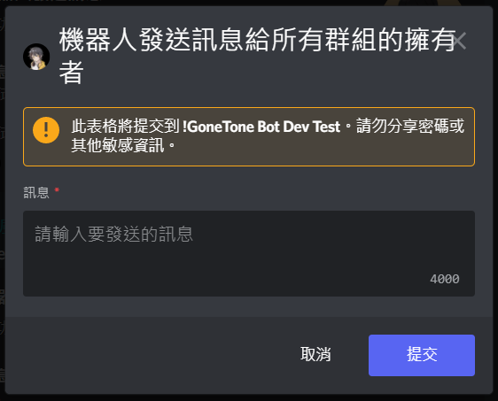
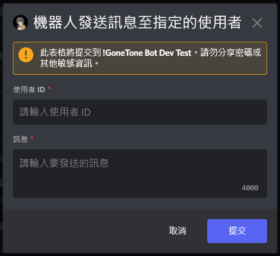

# 機器人發送訊息

[[toc]]

## 發送訊息給所有群組的擁有者

### 指令

::: warning
- 機器人擁有者才可執行此指令。
:::

:::: code-group
::: code-group-item 格式
```text:no-line-numbers
/bot sendmsg toallguildowner
```
:::
::::



## 發送訊息至指定的頻道

### 指令

::: warning
- 機器人擁有者才可執行此指令。
:::

:::: code-group
::: code-group-item 格式
```text:no-line-numbers
/bot sendmsg tochannel
```
:::
::::


## 發送訊息至指定的使用者

### 指令

::: warning
- 機器人擁有者才可執行此指令。
:::

:::: code-group
::: code-group-item 格式
```text:no-line-numbers
/bot sendmsg touser
```
:::
::::


