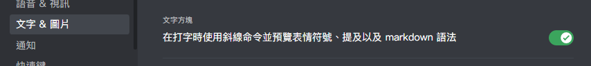
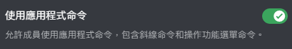
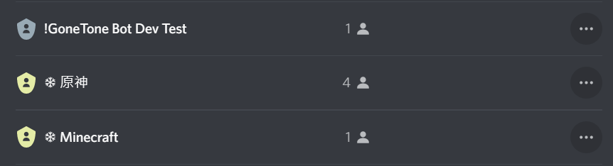

# 常見問題與解答

## Discord 沒辦法執行應用程式 (斜線) 指令

請至 Discord 開啟「使用者設定」→「文字 ＆ 圖片」→「文字方塊」，然後將「在打字時使用斜線命令並預覽表情符號、提及以及 markdown 語法」切換為開啟即可。

如果在群組內成員也必須要擁有「使用應用程式命令」權限。

## 機器人無法給予其他成員身分組

- 請確保有給予機器人「管理身分組」權限。
- 請確保機器人的身分組比要給成員領取的身分組排序還高。

