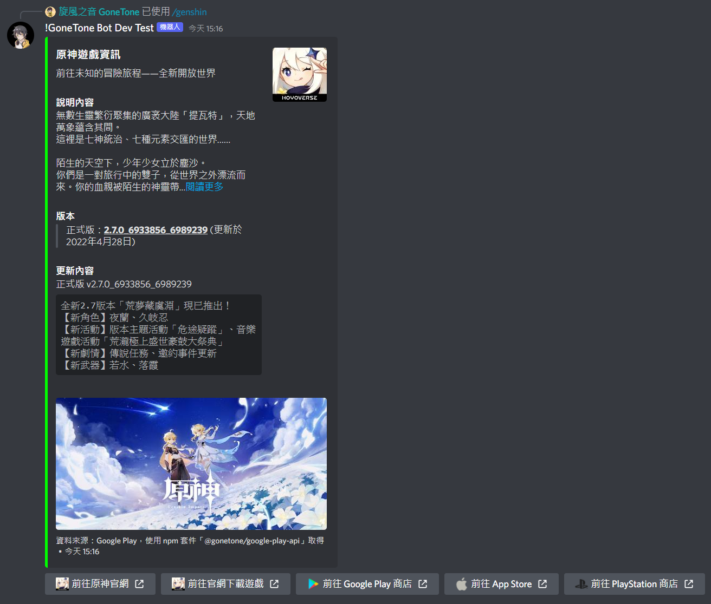

# 原神相關

[[toc]]

## 查詢原神角色資訊

### 指令

:::: code-group
::: code-group-item 格式
```text:no-line-numbers
/genshin character [name] [?vision]
```
:::
::: code-group-item 範例
```text:no-line-numbers
/genshin character 夜蘭
```
:::
::::

| 參數名稱   | 類型     | 說明                               | 必要  |
|--------|--------|----------------------------------|:---:|
| name   | String | 角色名稱                             |  V  |
| vision | String | 角色元素<br>- 如果角色有多種元素才需要輸入 (例如旅行者) |     |

## 查詢原神武器資訊

### 指令

:::: code-group
::: code-group-item 格式
```text:no-line-numbers
/genshin weapon [name]
```
:::
::: code-group-item 範例
```text:no-line-numbers
/genshin weapon 若水
```
:::
::::

| 參數名稱   | 類型     | 說明   | 必要  |
|--------|--------|------|:---:|
| name   | String | 武器名稱 |  V  |

## 查詢原神聖遺物資訊

### 指令

:::: code-group
::: code-group-item 格式
```text:no-line-numbers
/genshin artifact [name]
```
:::
::: code-group-item 範例
```text:no-line-numbers
/genshin artifact 絕緣之旗印
```
:::
::::

| 參數名稱 | 類型     | 說明      | 必要  |
|------|--------|---------|:---:|
| name | String | 聖遺物套裝名稱 |  V  |

## 查詢原神版本資訊

### 指令

:::: code-group
::: code-group-item 格式
```text:no-line-numbers
/genshin version
```
:::
::::

### 結果


