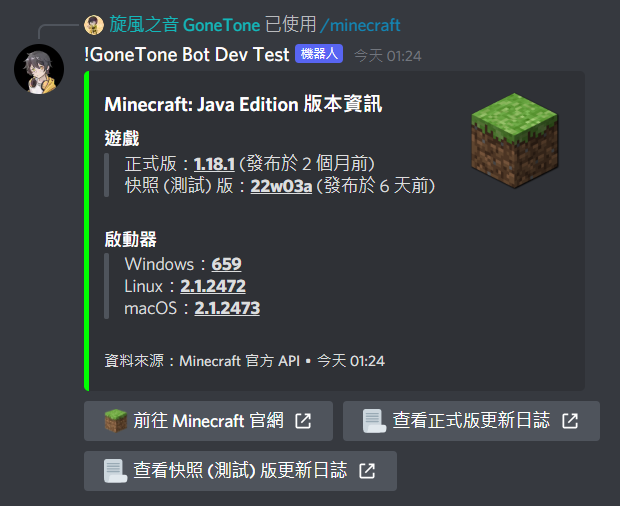
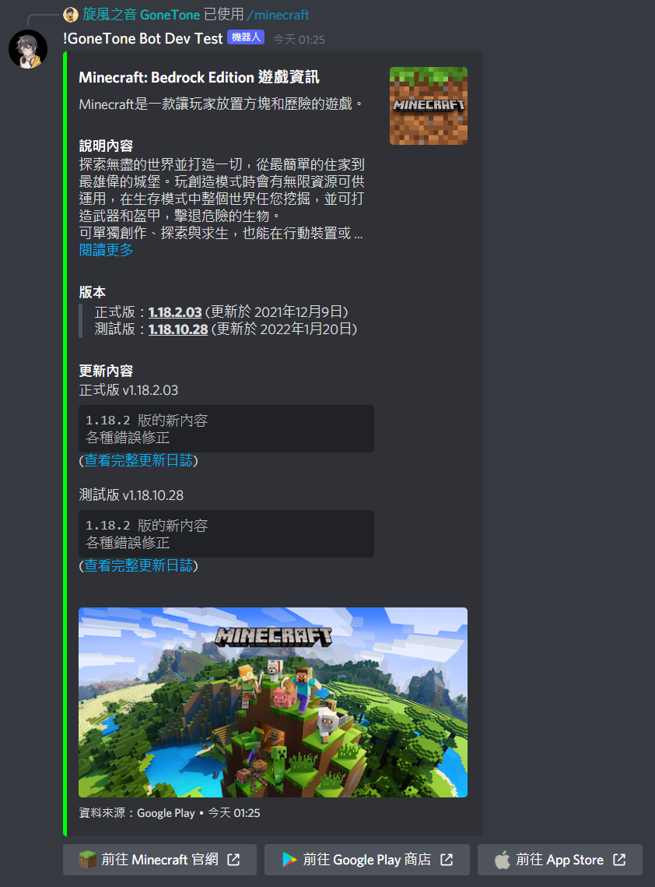

# Minecraft 相關

[[toc]]

## 查詢 Minecraft Java 或 BE 伺服器狀態

### 指令

::: tip
- Minecraft Jave 伺服器預設端口：25565<br>
- Minecraft BE 伺服器預設端口：19132
:::

:::: code-group
::: code-group-item 格式
```text:no-line-numbers
/minecraft server [?ip] [?port]
```
:::
::: code-group-item 範例
```text:no-line-numbers
/minecraft server mc.hypixel.net 25565
```
:::
::::

| 參數名稱 | 類型      | 說明     | 必要  |
|------|---------|--------|:---:|
| ip   | String  | 伺服器 IP |     |
| port | Integer | 伺服器端口  |     |


### 結果


## 查詢正版 Minecraft Java Edition 帳號 Skin

### 指令

::: warning
- 只能查詢正版 Minecraft Java Edition 帳號 Skin。
:::

:::: code-group
::: code-group-item 格式
```text:no-line-numbers
/minecraft skin [?name]
```
:::
::: code-group-item 範例
```text:no-line-numbers
/minecraft skin GoneTone
```
:::
::::

| 參數名稱 | 類型     | 說明                          | 必要  |
|------|--------|-----------------------------|:---:|
| name | String | Minecraft Java Edition 帳號暱稱 |     |


### 結果


## 查詢 Minecraft 版本資訊

### 指令

:::: code-group
::: code-group-item 格式
```text:no-line-numbers
/minecraft version [edition]
```
:::
::: code-group-item 範例 (Java 版本)
```text:no-line-numbers
/minecraft version Java 版本 (Java Edition)
```
:::
::: code-group-item 範例 (基岩版本)
```text:no-line-numbers
/minecraft version 基岩版本 (Bedrock Edition)
```
:::
::::

| 參數名稱    | 類型     | 說明                                                           | 必要  |
|---------|--------|--------------------------------------------------------------|:---:|
| edition | String | 版本類型<br>- Java 版本 (Java Edition)<br>- 基岩版本 (Bedrock Edition) |  V  |

### 結果




