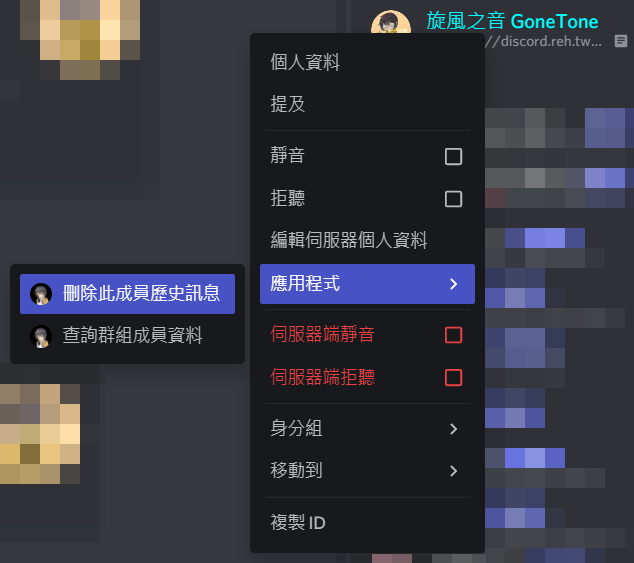
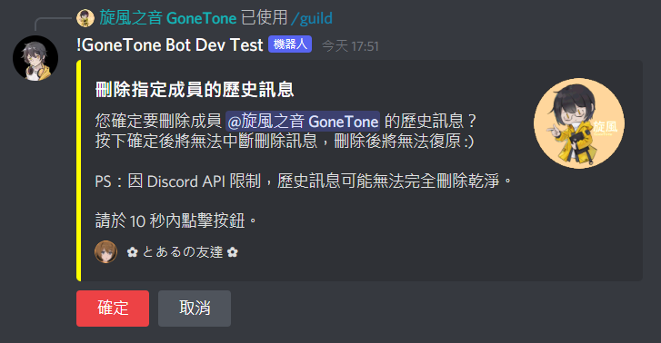
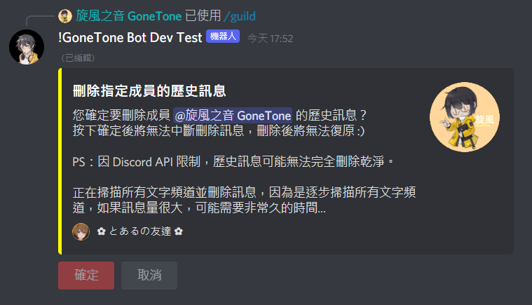
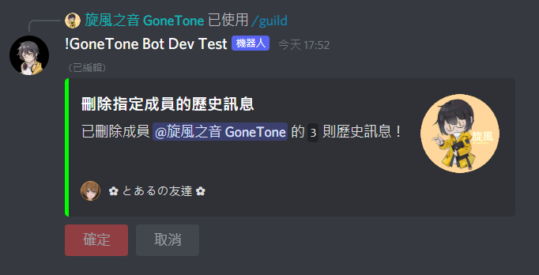

# 刪除指定成員的歷史訊息

[[toc]]

## 刪除指定成員的歷史訊息

### 指令

::: tip
- 只能在群組內執行此指令。
- 群組管理員才可執行此指令。
:::

:::: code-group
::: code-group-item 格式
```text:no-line-numbers
/guild deletemessages [member]
```
:::
::: code-group-item 範例
```text:no-line-numbers
/guild deletemessages @旋風之音 GoneTone
```
:::
::::

| 參數名稱   | 類型   | 說明   | 必要  |
|--------|------|------|:---:|
| member | User | 成員名稱 |  V  |

### 內容選單



### 結果






