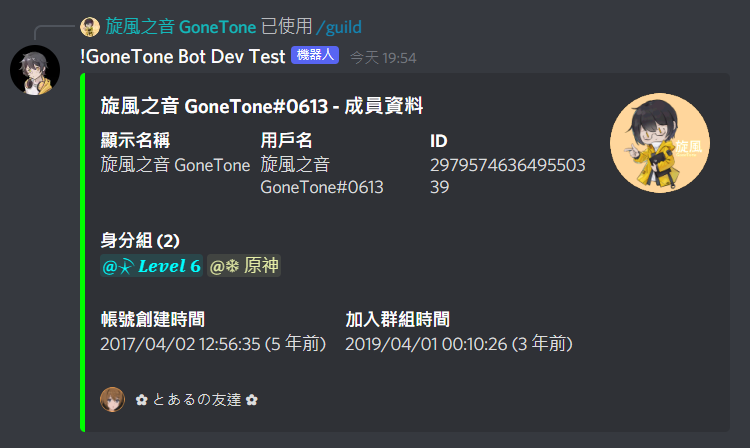
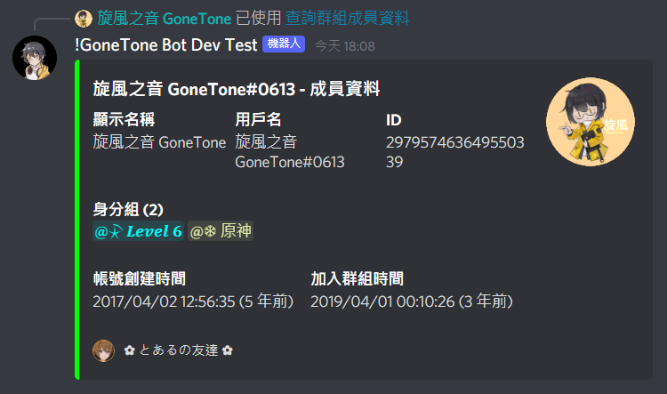

# 群組成員

[[toc]]

## 查詢群組成員數量

### 指令

::: tip
- 只能在群組內執行此指令。
:::

:::: code-group
::: code-group-item 格式
```text:no-line-numbers
/guild member count
```
:::
::::

### 結果


## 查詢群組成員資料

### 指令

::: tip
- 只能在群組內執行此指令。
:::

:::: code-group
::: code-group-item 格式
```text:no-line-numbers
/guild member info [?member]
```
:::
::: code-group-item 範例
```text:no-line-numbers
/guild member info @旋風之音 GoneTone
```
:::
::::

| 參數名稱   | 類型   | 說明                   | 必要  |
|--------|------|----------------------|:---:|
| member | User | 群組成員名稱 (如未輸入成員，則為自己) |     |

### 內容選單


### 結果

#### 指令



#### 內容選單


