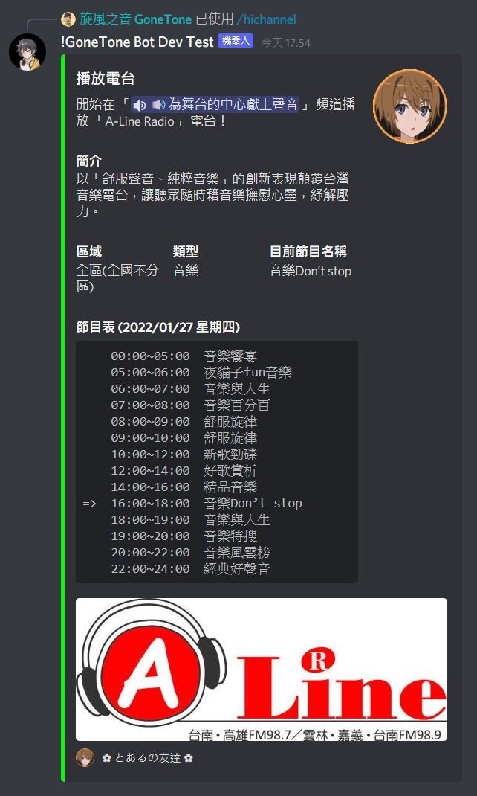
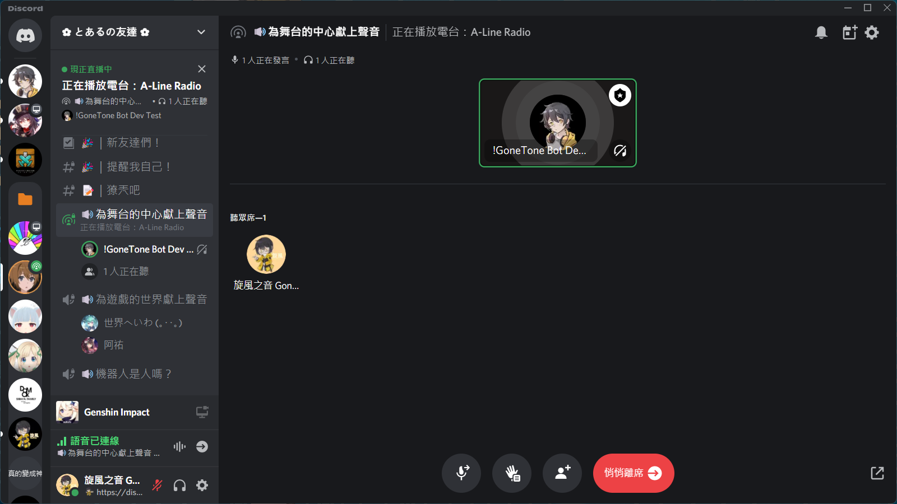

# HiNet hichannel 台灣電台

[[toc]]

## 播放電台

### 指令

::: tip
- 只能在群組內執行此指令。
- 必須先進入 `語音頻道` 或 `舞台頻道` 後才能執行此指令。
:::

:::: code-group
::: code-group-item 格式
```text:no-line-numbers
/hichannel play [radio]
```
:::
::: code-group-item 範例
```text:no-line-numbers
/hichannel play A-Line Radio
```
:::
::::

| 參數名稱  | 類型     | 說明   | 必要  |
|-------|--------|------|:---:|
| radio | String | 選擇電台 |  V  |

### 結果




