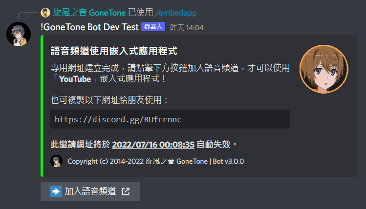
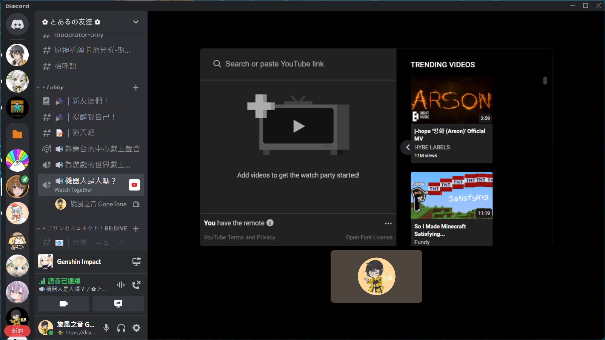

# 語音頻道使用嵌入式應用程式

[[toc]]

### 指令

::: warning
- 只能在群組內執行此指令。
- 機器人需要 `檢視頻道`、`建立邀請` 權限才可執行此指令。
:::

:::: code-group
::: code-group-item 格式
```text:no-line-numbers
/embedapp [app] [?channel]
```
:::
::: code-group-item 範例
```text:no-line-numbers
/embedapp YouTube #🔊機器人是人嗎？
```
:::
::::

| 參數名稱    | 類型      | 說明            | 必要  |
|---------|---------|---------------|:---:|
| app     | String  | 應用程式          |  V  |
| channel | Channel | 頻道 (只能指定語音頻道) |     |

### 結果




