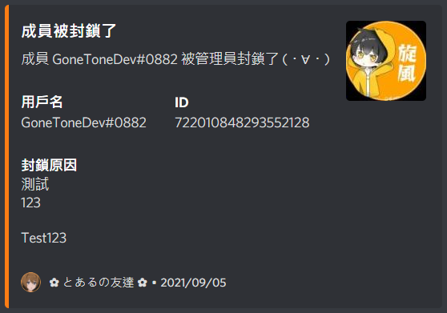

# 成員封鎖訊息

[[toc]]

## 設定用來顯示成員封鎖訊息的群組頻道

### 指令

::: warning
- 只能在群組內執行此指令。
- 群組管理員才可執行此指令。
:::

:::: code-group
::: code-group-item 格式
```text:no-line-numbers
/settings memberban setchannel [channel]
```
:::
::: code-group-item 範例
```text:no-line-numbers
/settings memberban setchannel #joinleave-gonetone-bot-dev-test
```
:::
::::

| 參數名稱    | 類型      | 說明                            | 必要  |
|---------|---------|-------------------------------|:---:|
| channel | Channel | 選擇文字頻道 (如未選擇頻道，則設定為當前輸入指令的頻道) |     |

### 結果


## 設定成員封鎖訊息

### 指令

::: warning
- 只能在群組內執行此指令。
- 群組管理員才可執行此指令。
:::

:::: code-group
::: code-group-item 格式
```text:no-line-numbers
/settings memberban set
```
:::
::::

::: tip
訊息可插入符號：
- `{member}` 成員名稱
- `{guild}` 群組名稱
:::


### 結果


## 設定成員封鎖訊息是否開啟

### 指令

::: warning
- 只能在群組內執行此指令。
- 群組管理員才可執行此指令。
:::

:::: code-group
::: code-group-item 格式
```text:no-line-numbers
/settings memberban switch [boolean]
```
:::
::: code-group-item 範例
```text:no-line-numbers
/settings memberban switch true
```
:::
::::

| 參數名稱    | 類型      | 說明         | 必要  |
|---------|---------|------------|:---:|
| boolean | Boolean | 成員封鎖訊息是否開啟 |  V  |

### 結果


## 清除成員封鎖訊息的所有設定

### 指令

::: warning
- 只能在群組內執行此指令。
- 群組管理員才可執行此指令。
:::

:::: code-group
::: code-group-item 格式
```text:no-line-numbers
/settings memberban clear
```
:::
::::

### 結果


## 查看目前成員封鎖訊息的設定

### 指令

::: warning
- 只能在群組內執行此指令。
- 群組管理員才可執行此指令。
:::

:::: code-group
::: code-group-item 格式
```text:no-line-numbers
/settings memberban query
```
:::
::::

### 結果


## 成員封鎖訊息 Demo


