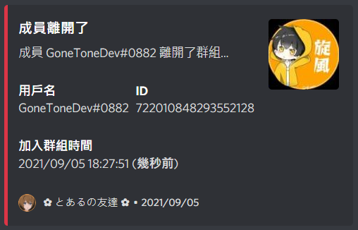

# 成員離開訊息

[[toc]]

## 設定用來顯示成員離開訊息的群組頻道

### 指令

::: warning
- 只能在群組內執行此指令。
- 群組管理員才可執行此指令。
:::

:::: code-group
::: code-group-item 格式
```text:no-line-numbers
/settings memberleave setchannel [channel]
```
:::
::: code-group-item 範例
```text:no-line-numbers
/settings memberleave setchannel #joinleave-gonetone-bot-dev-test
```
:::
::::

| 參數名稱    | 類型      | 說明                            | 必要  |
|---------|---------|-------------------------------|:---:|
| channel | Channel | 選擇文字頻道 (如未選擇頻道，則設定為當前輸入指令的頻道) |     |

### 結果


## 設定成員離開訊息

### 指令

::: warning
- 只能在群組內執行此指令。
- 群組管理員才可執行此指令。
:::

:::: code-group
::: code-group-item 格式
```text:no-line-numbers
/settings memberleave setmessage [message]
```
:::
::: code-group-item 範例
```text:no-line-numbers
/settings memberleave setmessage 成員 {member} 離開了群組...
```
:::
::::

| 參數名稱    | 類型     | 說明                                                                   | 必要  |
|---------|--------|----------------------------------------------------------------------|:---:|
| message | String | 成員封鎖訊息<br><br>可插入符號：<br>`\n` 換行<br>`{member}` 成員名稱<br>`{guild}` 群組名稱 |  V  |

### 結果


## 設定成員離開訊息是否開啟

### 指令

::: warning
- 只能在群組內執行此指令。
- 群組管理員才可執行此指令。
:::

:::: code-group
::: code-group-item 格式
```text:no-line-numbers
/settings memberleave switch [boolean]
```
:::
::: code-group-item 範例
```text:no-line-numbers
/settings memberleave switch true
```
:::
::::

| 參數名稱    | 類型      | 說明         | 必要  |
|---------|---------|------------|:---:|
| boolean | Boolean | 成員離開訊息是否開啟 |  V  |

### 結果


## 清除成員離開訊息的所有設定

### 指令

::: warning
- 只能在群組內執行此指令。
- 群組管理員才可執行此指令。
:::

:::: code-group
::: code-group-item 格式
```text:no-line-numbers
/settings memberleave clear
```
:::
::::

### 結果


## 查看目前成員離開訊息的設定

### 指令

::: warning
- 只能在群組內執行此指令。
- 群組管理員才可執行此指令。
:::

:::: code-group
::: code-group-item 格式
```text:no-line-numbers
/settings memberleave query
```
:::
::::

### 結果


## 成員離開訊息 Demo


