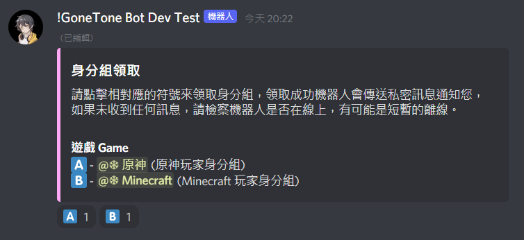
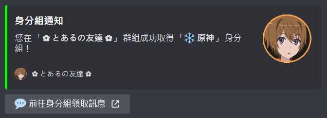
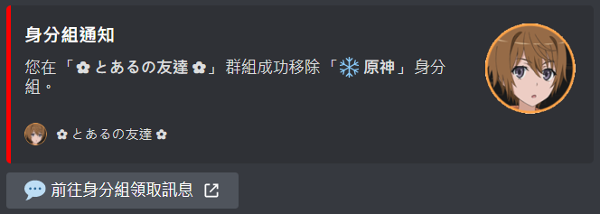
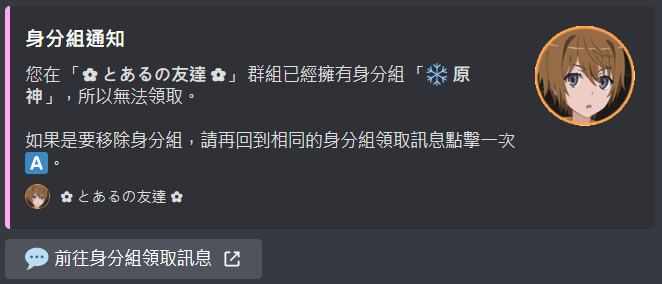

# 身分組領取

[[toc]]

## 設定用於領取身分組的頻道

### 指令

::: warning
- 只能在群組內執行此指令。
- 成員需要 `管理身分組` 權限才可執行此指令。
- 機器人需要 `管理身分組`、`嵌入連結` 權限才可執行此指令。
:::

:::: code-group
::: code-group-item 格式
```text:no-line-numbers
/settings rolereceive set [channel]
```
:::
::: code-group-item 範例
```text:no-line-numbers
/settings rolereceive set #身分組領取測試
```
:::
::::

| 參數名稱    | 類型      | 說明     | 必要  |
|---------|---------|--------|:---:|
| channel | Channel | 選擇文字頻道 |  V  |

### 結果


## 新增可領取的身分組

### 指令

::: warning
- 只能在群組內執行此指令。
- 成員需要 `管理身分組` 權限才可執行此指令。
- 機器人需要 `管理身分組`、`嵌入連結` 權限才可執行此指令。
:::

:::: code-group
::: code-group-item 格式
```text:no-line-numbers
/settings rolereceive add [role] [categoryname] [?description]
```
:::
::: code-group-item 範例
```text:no-line-numbers
/settings rolereceive add @❄ 原神 遊戲 Game 原神玩家身分組
```
:::
::::

| 參數名稱         | 類型     | 說明    | 必要  |
|--------------|--------|-------|:---:|
| role         | Role   | 選擇身分組 |  V  |
| categoryname | String | 分類名稱  |  V  |
| description  | String | 說明    |     |

### 結果


## 移除可領取的身分組

### 指令

::: warning
- 只能在群組內執行此指令。
- 成員需要 `管理身分組` 權限才可執行此指令。
- 機器人需要 `管理身分組`、`嵌入連結` 權限才可執行此指令。
:::

:::: code-group
::: code-group-item 格式
```text:no-line-numbers
/settings rolereceive remove [role]
```
:::
::: code-group-item 範例
```text:no-line-numbers
/settings rolereceive remove @❄ 原神
```
:::
::::

| 參數名稱         | 類型     | 說明    | 必要  |
|--------------|--------|-------|:---:|
| role         | Role   | 選擇身分組 |  V  |

### 結果


## 修復領取身分組的訊息

### 指令

::: warning
- 只能在群組內執行此指令。
- 成員需要 `管理身分組` 權限才可執行此指令。
- 機器人需要 `管理身分組`、`嵌入連結` 權限才可執行此指令。
:::

:::: code-group
::: code-group-item 格式
```text:no-line-numbers
/settings rolereceive fix
```
:::
::::

### 結果


## 清除領取身分組的設定

### 指令

::: warning
- 只能在群組內執行此指令。
- 成員需要 `管理身分組` 權限才可執行此指令。
- 機器人需要 `管理身分組`、`嵌入連結` 權限才可執行此指令。
:::

:::: code-group
::: code-group-item 格式
```text:no-line-numbers
/settings rolereceive clear
```
:::
::::

### 結果


## 身分組領取訊息 Demo

#### 用於領取身分組的訊息



#### 領取身分組成功的訊息



#### 移除身分組成功的訊息



#### 已擁有身分組的訊息


